

#  Handymon

Simple, Free Windows Server &amp; SQL Server Monitoring

Handymon is a free lightweight TUI monitoring tool for small businesses, schools, churches, nonprofits, or other organizations with limited IT resources. It focuses on what matters most: sending alerts when Windows servers, SQL Server database instances, or disks need attention.

Monitor multiple Windows Servers and SQL Server instances without limits. Receive timely notifications via email or Slack, schedule blackout periods for maintenance, and automate routine checks with background polling threads.

Built for the lone IT worker, Handymon is easy to install, simple to configure, and scales as your organization grows. No dashboards, no licensing fees, no unnecessary complexity - just reliable alerts when you need them.

Handymon - simple, free, and built to just work.

##  Features

- Easy Installation
- Documentation Included
- Supports Alerting Through Email and Slack
- Windows Alerts: Online/Offline, Reboots, Low Disk Space
- SQL Server Alerts: Online/Offline/Offline Reminders, New Databases, Deleted Databases, New Jobs, Deleted Jobs, Job Errors
- Supports Rerouting or Cancelling Alerts using Alert Rules
- Runs on Windows 10, Windows Server 2012 R2, and later

##  Installation

To install Handymon:

- Download the official installer &nbsp; 
- Run it.

##  Quick start

- After installing via the setup executable, launch and review the Handymon Documentation.
- Then, launch the Configure Handymon shortcut.

##  Screenshots

Click any thumbnail to open the full-size image.

- [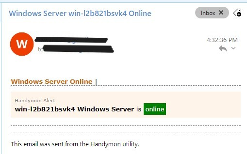](./images/server-added-email-notification.jpg) — Windows Server Added email
-  — Windows Server Added slack notification
- [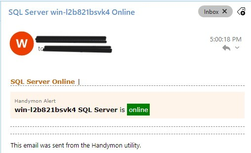](./images/sql-server-added-email-notification.jpg) — SQL Server Added email
-  — SQL Server Added slack notification
- [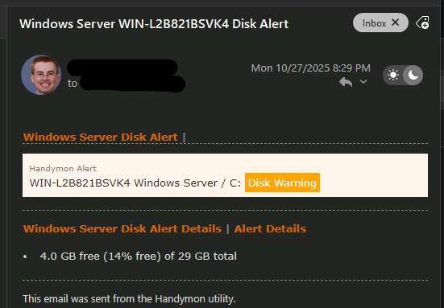](./images/disk-space-warning-email.png) — Disk Space Warning email
- [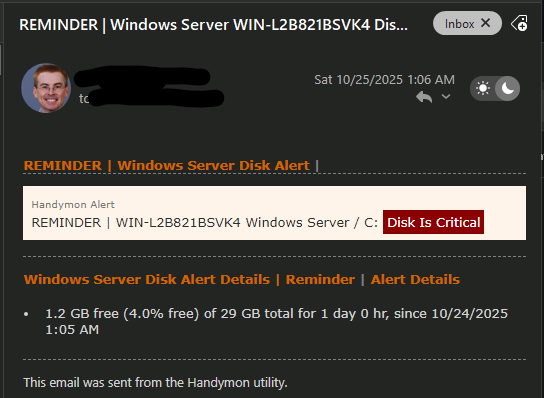](./images/disk-space-warning-reminder-email.png) — Disk Space Warning Reminder email
- [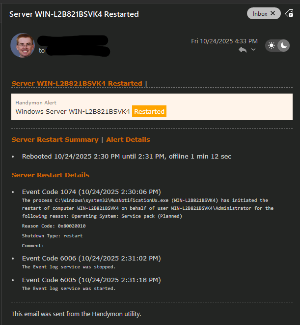](./images/win-server-rebooted-email.png) — Windows Server Rebooted email
- [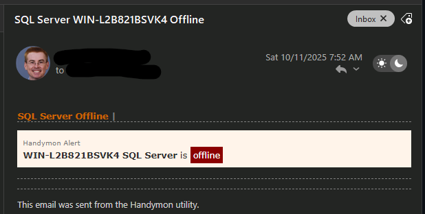](./images/win-server-offline-email.png) — Windows Server Offline email
-  — SQL Server Agent Job Error email

- [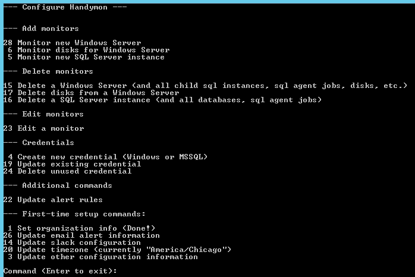](./images/01-configure-home.png) — Home
- [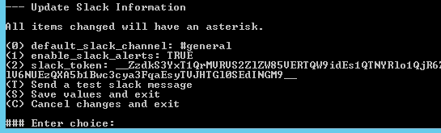](./images/02-configure-slack.png) — Configure Slack
- [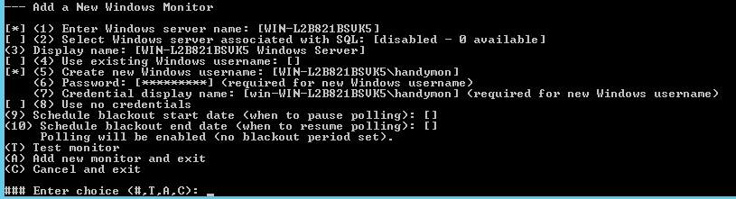](./images/03-configure-add-win-monitor.png) — Add Windows Monitor
- [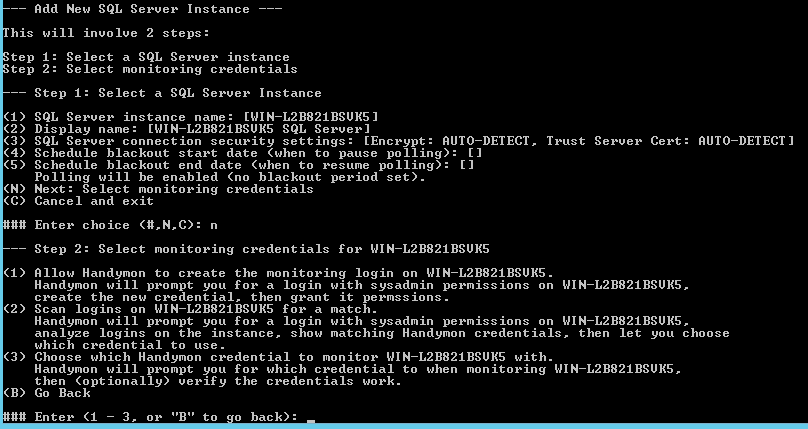](./images/04-configure-add-mssql-monitor.png) — Add MSSQL Monitor
- [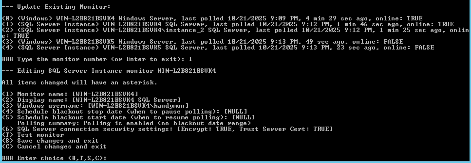](./images/05-configure-update-monitor.png) — Update Monitor
- [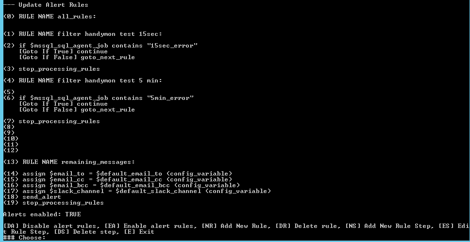](./images/06-configure-update-alerting-rules.png) — Update Alerting Rules

##  Contributing

Contributions, bug reports and feature requests are welcome.

- Open an issue on GitHub to discuss bugs or feature ideas.
- Keep changes small and focused; describe the goal and any compatibility notes in your PR.

##  License

This project is provided under the MIT License — see the `LICENSE` file for details.

##  Where to get help

- Open an issue on GitHub if you need support or want to report a problem.

